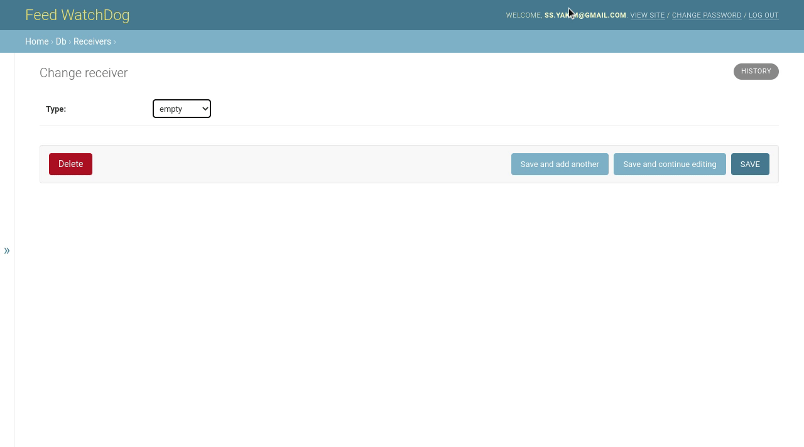

# django-better-json-widget

[](https://github.com/yakimka/django-better-json-widget/actions?query=workflow%3Apackage)
[](https://codecov.io/gh/yakimka/django-better-json-widget)
[](https://pypi.org/project/django-better-json-widget/)
[](https://pepy.tech/project/django-better-json-widget)

Better JSON Widget for Django Admin



## Features

- Better Json widget with schema for your Django Admin site
- Can watch for changes in the given field (`follow_field`) and dynamically update the JSON schema
- Supports [JSON Schema](https://json-schema.org/)
- You can edit generated UI fields specified in schema or edit raw JSON
- Use Vue.js for UI
- Supports Python 3.8+ and Django 3.2+

## Limitations

- Supports only a small subset of the JSON Schema (integer, number, boolean, string types)
- Does not support enum, list types (yet) and nested objects (not planned)

So, PR's are welcome!

## Installation
 
Install package 

```bash
pip install django-better-json-widget
```

Add `better_json_widget` to your `INSTALLED_APPS`

## Example

```python
from better_json_widget.widgets import BetterJsonWidget
from django.contrib import admin
from django.forms import ModelForm

from .models import TestModel


schema_mapping = {
    "animal": {
        "$schema": "https://json-schema.org/draft/2020-12/schema",
        "type": "object",
        "properties": {
            "limbs": {
                "type": "integer",
                "title": "Number of limbs",
                "description": "How many limbs does the animal have?",
            },
            "color": {"type": "string", "title": "Color"},
            "herbivore": {
                "type": "boolean",
                "title": "Is it herbivore?",
                "default": True,
            },
        },
        "required": ["limbs", "herbivore"],
    },
    "superhero": {
        "$schema": "https://json-schema.org/draft/2020-12/schema",
        "type": "object",
        "properties": {
            "name": {
                "type": "string",
                "title": "Name",
                "description": "Give a name to your superhero",
            },
            "superpower": {"type": "string"},
        },
        "required": ["name"],
    },
}

class TestModelAdminForm(ModelForm):
    class Meta:
        model = TestModel
        fields = "__all__"
        widgets = {
            "options": BetterJsonWidget(
                follow_field="type",
                # `schema_mapping` and `schema` can be callables
                schema_mapping=schema_mapping,
            ),
        }


@admin.register(TestModel)
class TestModelAdmin(admin.ModelAdmin):
    form = TestModelAdminForm
    fields = [
        "type",
        "options",  # JsonField
    ]
```

Also, if you don't need to dynamically change schema, you can use `schema` option:

```python
BetterJsonWidget(
    schema={
        "$schema": "https://json-schema.org/draft/2020-12/schema",
        "type": "object",
        "properties": {
            ...
        },
        "required": [],
    },
)
```

## Settings

If for some reason you don't want to use bundled Vue.js, you can use `BETTER_JSON_WIDGET_VUE_ESM_URL` settings:

```python
BETTER_JSON_WIDGET_VUE_ESM_URL = "https://unpkg.com/vue@3/dist/vue.esm-browser.js"
```

## TODO

- Improve JSON Schema support
- Show current field value in UI
- UI tests

## License

[MIT](https://github.com/yakimka/django-better-json-widget/blob/master/LICENSE)

## Credits

This project was generated with [`yakimka/cookiecutter-pyproject`](https://github.com/yakimka/cookiecutter-pyproject).
